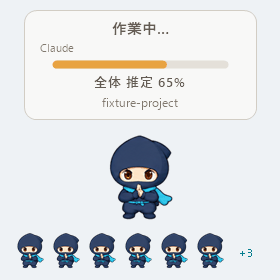

# Tiny Code Pet 🥷

[](https://github.com/nikotaronosuke/tiny-code-pet/actions/workflows/build.yml)
[](LICENSE)


> Claude Code と Codex のための、小さな Windows ネイティブのデスクトップ Pet。

Claude Code / Codex の作業状況・依頼全体の推定進捗・作業終了を、
画面右下の小さな忍者で確認できる **Windows ネイティブのデスクトップ Pet** です。
Claude Code と Codex を同時に使っても session / 状態は衝突しません。



**一目でわかる特徴**

| | |
|---|---|
| 🤖 **Claude Code + Codex 対応** | 1 匹の Pet が両方を監視。どちらか片方だけでも使える |
| 🪟 **Windows native** | 純 Win32 (C# P/Invoke)。Electron / WebView / Node 常駐なし |
| 🚫 **邪魔をしない** | クリック透過・タスクバー/Alt+Tab 非表示・focus を奪わない |
| 🥷 **tray から操作** | 表示 / 隠す / 最前面に戻す / 終了 |
| 📊 **依頼全体の推定進捗** | 「今のタスク」ではなく依頼全体の工程表から算出 |
| ✅ **root Stop + 20 秒静穏で完了** | tracker の状態に依存しない誠実な完了判定 |
| 🔒 **privacy** | prompt / 応答 / ソース本文を一切読まない |
| 🥷 **忍者と影分身** | 待機・作業・完了のアニメーションと、サブエージェント最大6体の表示 |

> **なぜこの設計にしたか:** [Owner Decision Log](docs/OWNER_DECISIONS.md)  
> 実測で捨てた案、完了判定を作り直した理由、AIの作業を重くしてまで進捗表示を滑らかにしなかった判断をまとめています。

## 表示

完全 auto 運用向けに、見える状態は 3 つだけ:

| 状態 | 表示 | 意味 |
|---|---|---|
| Idle | 🥷 + `Tiny Code Pet` | 何もしていない。呼吸・瞬きの低速ループ |
| 作業中 | 🥷 + 「作業中…」(+ 「**全体 推定 N%**」) + project名 | 工程名と経過時間を併記。入力・承認待ちや終了通知後の待機中は補助行に表示 |
| 完了 | 🥷 + 「終わったよ！」+ project名 | root Stop の後 20 秒間その作業が再開されなかった (決めポーズを1回再生・通知音1回・約5秒後に Idle) |

**「未完了」表示は無い。** 完了と言い切れない停止は何も出さずに Idle へ戻る。

表示中の session には **provider + model** の 1 行が付く (`Claude · Opus 4.6` /
`Codex · GPT-5.6-codex`)。model を取れないときは provider だけ。
同行の右端の **`+N`** は「他に動いている session 数」で、
Working / Finalizing / Waiting の session だけを数える (0 なら非表示)。

確認要求 UI・警告音・activity indicator は廃止した。音が鳴るのは完了時の 1 回だけ。

## 主な特徴

- Native Win32 (C# P/Invoke)。**Electron / WebView / Node 常駐 / localhost サーバー / DB 一切なし**
- 状態監視は event-driven (Hooks 連携)。polling なし。表示中のみアニメーションtimerが動く
- 背景完全透過・枠なし・タスクバー/Alt+Tab 非表示・常に最前面
  (通常ウィンドウより前。TOPMOST を失っても表示更新時に自動復帰)
- **クリック透過**: キャラの背後にある VS Code や Chrome をそのまま操作できる
- **通知領域 (system tray) の 🥷 アイコン**から 表示 / 隠す / 最前面に戻す / 終了 を操作
- 依頼全体の推定進捗表示 (新 Task システム / TodoWrite の両対応)
- 進捗と完了判定は完全に独立 (進捗 % は plan から、完了は Stop + 静穏から)
- 複数セッションの同時追跡 (優先度付き表示)
- 別の Claude セッションのツール内から起動された子 Claude (`claude -p` 等) の通知抑制
- Subagent 完了の誤通知防止
- **Codex 対応** (別 adapter / provider + session + turn で状態分離)

## 忍者アニメーションと分身

- メイン: 待機は約4秒静止して短く瞬き・ごく小さな呼吸。作業は200ms間隔で手元だけ動かす。
  頭・足・マフラーは固定。完了は8フレームを1回再生する。
- 分身は400ms間隔でメインよりゆっくり動く。
- [待機プレビュー](docs/assets/ninja-idle.gif) / [作業中プレビュー](docs/assets/ninja-working.gif)
- 分身: 表示中の親セッションの `SubagentStart` / `SubagentStop` に連動。
  最大6体を小さく並べ、超過分は分身の横に `+N` で表示する。
  HUDの `+N` は従来どおり別セッション数で、分身とは別の情報。
- 同じPNGを共用し、分身の再生タイミングをずらす。出入りに短い煙の演出。
- identityが取れない場合は人数を推測しない。重複・終了先着を抑制し、
  新しい依頼・セッション終了・親の完了で分身をクリアする。
- 非表示中はアニメーションtimerを停止。状態監視・完了判定は継続する。
- 素材: `assets/ninja/ninja.png` (1024×384、128pxセル×8列×3行)。
  `ninja.json` に各動作の行・フレーム数・速度・ループ指定を持つ。
  PNG/JSONはexeに埋め込まれ、配布時に追加ファイルは不要。

## 軽さと検証

旧ヒヨコ版の「待機CPUほぼ0 / RAM十数MB」は忍者版の測定値ではありません。
忍者版は表示中に低FPSの再描画を行います。常駐版のCPU・メモリは実環境での計測が必要です。
テキストHUDはイベント時と経過秒が変わった時だけ再生成し、それ以外のフレームではキャラクターを合成します。
TOPMOSTの再保証は状態変更・明示操作時だけで、フレーム更新では行いません。

`./test.ps1` で状態遷移、分身の重複・順序逆転、旧ターン除外、20秒静穏、
透過、アニメーション、非表示timer停止、描画リソースを検証できます。
ローカル検証では85項目通過、500フレーム後のGDIオブジェクト増加は0でした。
100% / 125% / 200%スケールのオフスクリーン描画も確認しています。
実際のClaude/Codexが分身Hookを発火するところまでの結合検証は未実施です。
Codexデスクトップアプリでは、Hook承認後にアプリ本体と内部プロセスを再起動し、
実際の会話に連動した「作業中…」とprovider/model表示を確認しています。
この確認は、実セッションの分身Hookや完了音までの結合検証を意味しません。

## しくみ

```
Claude Code hooks (user-level settings.json / 全て async・fire-and-forget)
  Stop ── UserPromptSubmit ── Notification(matcher=permission_prompt)
  PostToolUse(matcher=*) ── SessionEnd ── TaskCreated ── TaskCompleted
        │  stdin の JSON から status metadata のみ読む
        │  (hook_event_name / session_id / cwd / agent_id / tool_name / task status)
        ▼
ClaudePetNotify.exe   … Hook Adapter。正規化イベントへ変換して即終了
        │  WM_COPYDATA: dwData=イベント種別, payload="session_id\nproject名\nextra"
        ▼
ClaudePet.exe         … 常駐ペット。session_id 単位の状態機械 (依頼=Request 単位で進捗管理)
        ▼
Win32 layered window  … UpdateLayeredWindow で ARGB 描画 (表示中は低FPSでキャラクターを更新)
```

Codex は別の adapter を通る (Claude 側の契約は一切変えていない):

```
Codex Hooks (hooks.json)
  UserPromptSubmit ── PostToolUse(.*) ── PermissionRequest(.*)
  Stop ── SessionEnd ── SubagentStart ── SubagentStop
        │  stdin の JSON から status metadata のみ読む
        │  (hook_event_name / session_id / turn_id / cwd / tool_name / plan[].status)
        ▼
CodexPetNotify.exe    … Codex Hook Adapter。dwData 20〜28 へ変換して即終了
        │  WM_COPYDATA: dwData=20〜28、payload は 4 行
        │  (session_id / project名 / extra / turn_id を改行区切り)
        ▼
ClaudePet.exe         … 同じ常駐ペット。provider + session + turn で状態を分ける
```

- 実装: C# (P/Invoke による純 Win32)。**.NET Framework 4.8 同梱の csc.exe でビルドするため追加インストール不要**
- 状態監視はpollingなし。表示中のアニメーションtimerと、quiet window・表示期限のtimerを使用
- 通知領域アイコンは `Shell_NotifyIcon` (純 Win32)。アイコン画像も実行時に
  System.Drawing で描く (外部画像ファイルなし)。taskbar ボタンや Alt+Tab には出ない
- ペット未起動時は Stop / UserPromptSubmit / permission_prompt で自動起動 (高頻度な PostToolUse では起動しない)
- **Prompt 本文・応答本文・ソースコードを送信・解析して進捗を推定しているわけではない**。
  扱うのは Hook が配る構造化 status metadata のみ

### 依頼全体の推定進捗

Codexで計画情報が出ない場合は、利用中のバージョンが提供する計画ツールの設定を確認してください。
Codex 0.152.0以降の有効化設定は、config.tomlのルートで
`tools.update_plan.enabled = true` です。既存の `[tools.update_plan]` がある場合は
その中の `enabled = true` を使い、重複定義しないでください。
Hookインストーラはこの設定を自動変更しません。
設定保存だけでは進捗の復旧確認になりません。実セッションでツールが提供され、
2項目以上の計画のPostToolUseがPetまで届く必要があります。
[公式リリース記録](https://github.com/openai/codex/releases/tag/rust-v0.152.0)

### 現在の工程と経過時間

- 作業中のHUDに、推定進捗率とは別に `工程：表示を検証する` と `経過 05:23` を表示します。
- Codex update_planのstep、Claude TodoWriteのactiveForm（なければcontent）から、
  単一のin_progress工程名だけを表示用に読みます。Prompt・応答・コマンド本文は読みません。
  工程名はメモリ内のみで最大120文字、画面では最大2行・長いものは省略します。
- 工程名は最後に通知された計画上の現在地であり、実行中のツールや応答の実況ではありません。
  trackerがない、複数工程が同時進行、ClaudeのTaskCreated/TaskUpdate系で名前が取れない、
  Codexでsubagentを検知した場合は工程名を推測しません。
- 新しい依頼で時計と工程名をリセットします。開始Hookを取り逃した場合（Petの途中起動等）は
  `観測から 00:00` と表示し、依頼開始から測れたようには見せません。
- 経過時間は表示中だけ既存animation timerで毎秒更新。非表示中は描画せず、再表示で追いつきます。
  時間経過による進捗の水増し、残り時間予測、稼働・完了判定は行いません。
- 入力待ちは `入力・承認待ち`、Stop後20秒の静穏待ちは `終了通知後の待機中` と補足します。
  完了通知が出たら工程と時計は消えます。完了条件・通知音は従来どおりです。

### 終了・中断の補助情報

- Claude Stopの `background_tasks` にmonitor以外の処理中作業があれば、
  「作業中…」のまま完了候補を保留します。次のroot Stopが必要です。
- フィールド欠落は従来の20秒方式へfallbackします。空配列との区別を維持し、
  不正なmetadataを「背景作業なし」とは扱いません。
- 常設monitorと予約されたsession_cronsは現在turnの完了を妨げません。
  shellが常設処理かどうかはコマンド本文を読まないため判断できず、保守的に保留します。
- Claude StopFailure / Codex Interruptは完了候補を取り消して静かに終了します。
  完了音は鳴らしません。Codexは新しいInterrupt Hookの登録・信頼が必要です。
- 20秒待機、継続イベントでの候補取消し、進捗と完了の独立は維持します。
  これは成果物の正しさや、別途予約した作業までの達成保証ではありません。

### 進捗の計算

「依頼 (Request)」= そのセッションで最後に `UserPromptSubmit` が来てから Stop までの1ターン。
新しい依頼が始まると前回依頼の進捗はリセットされる。

表示される % は「**最初に投げた依頼全体が、工程表のどこまで進んだか**」の推定であって、
**今実行中の 1 タスクの進捗ではない**。structured plan/task を
「依頼完了までの工程表」とみなし、その全工程の status から計算する。

例: 「completion ロジックを変更して、テストして、docs も更新して」という依頼なら、
plan は「現状確認 / 実装 / UI 調整 / 回帰確認 / テスト追加 / 全 suite 実行 /
build 確認 / docs 更新」のように依頼全体を分解したものになる。この 8 工程から % を出す。
「今このファイルを編集中」だけを plan にすると、それは依頼全体の進捗にならない。

- 計算式: `(completed + 0.5 × in_progress) ÷ total × 100` (小数切り捨て)。
  in_progress は **「工程表の中の 1 工程が進行中なので 0.5 工程ぶん」** として数える。
  「その工程自体が 50% 終わった」という意味ではない
- **valid total >= 2 のときだけ % を出す**。total=1 の plan は「今やっている 1 個」でしかなく
  依頼全体の進捗としての根拠が弱いので % を表示しない (tracker 自体は保持する)
- total <= 0 (tracker なし / 空 / 解析不能) でも % は出さない。
  経過時間やツール実行回数から進捗を捏造することはしない
- **ETA ではない**。残り時間の予測は一切しない
- **途中で工程が増えると % が下がることがある**。これは嘘ではなく
  「依頼全体の見積もりが更新された」結果なので、単調増加させるための補正はしない
- Task 件数 (3/5 等) は UI に出さない
- **進捗は完了判定に一切関与しない**。100% でも Stop が無ければ完了しないし、
  50% でも Stop + 静穏があれば完了する

進捗のデータ源は2系統:

1. **TaskCreated / TaskCompleted hook + PostToolUse(TaskUpdate)**: 新 Task システム
   (`TaskCreate` / `TaskUpdate` ツール) のセッション。`task_id` の一意集合 (Set) で管理するため
   重複通知でも二重加算されない (上限 256 件/セッション)。in_progress・削除/キャンセルも反映
2. **TodoWrite スナップショット**: TodoWrite のセッションでは PostToolUse payload の
   `tool_input` 内の `"status"` 値の件数だけを数えて `completed/in_progress/total` を導出する
   (工程名は表示専用で読み、件数には影響させない)。全量スナップショットなので重複発火しても冪等

両方を同一依頼内で観測した場合は TodoWrite スナップショットを優先。

### 完了判定 (Completion semantics)

完了判定は **root Stop + 20 秒の静穏 (`CompletionQuietMs`) だけ**で決まる。
provider 共通で、Claude も Codex も同じ 20 秒を使う。

```
root Stop 受信
  └─ completion candidate。UI は「作業中…」のまま (進捗 % もそのまま)
        ├─ 20 秒以内に作業継続イベント → candidate 取消。Working へ戻る
        │    (次に完了できるのは新しい Stop が来てから)
        ├─ 20 秒以内に Stop 再受信     → 最新 Stop から 20 秒を数え直す
        ├─ 20 秒以内に新しい依頼        → 古い candidate は破棄。新しい作業を表示
        └─ 20 秒静穏で満了
              ├─ 他に動いている session が無い → 終わったよ！ (音1回・約5秒後に Idle)
              └─ 他に動いている session がある → 通知を出さずに片付ける (音も無し・再キューもしない)
```

**`終わったよ！` の意味**は「成果物が数学的に 100% 正しい」ではない。
Pet が prompt / 応答 / 成果物本文を読まずに判定できる範囲での

> **Claude Code / Codex が root Stop を出し、その後 20 秒間その作業を再開しなかった**

という事実だけを表す。

- **structured tracker は完了の証拠にしない**。進捗の推定材料にすぎない。
  94% でも / pending が残っていても / tracker が壊れていても / tracker が無くても、
  Stop + 20 秒静穏なら完了として通知する
- 逆に **100% でも Stop が来なければ完了しない**。interrupt のように Stop が
  来ないケースでは推測 timeout で完了させない
- **SessionEnd 単体は完了の根拠にしない**。Stop 済みの session なら SessionEnd が
  来ても candidate を維持し、Stop なしの SessionEnd では静かに片付けて Idle に戻る
- 「作業継続イベント」= Claude なら PostToolUse / Task 系 / TodoWrite / permission、
  Codex なら同一 turn の PostToolUse / update_plan / PermissionRequest /
  SubagentStart / SubagentStop。Codex の **old-turn の遅延イベントは current turn の
  candidate を取消さない** (provider + session + turn の分離は維持)
- 同一依頼への重複 Stop / 遅延イベントでも通知は1回だけ (debounce + tombstone)
- **Task の削除/キャンセル (`TaskUpdate` status=deleted/cancelled) には対応する hook が発火しない**
  (実測)。PostToolUse から検知して total から除外する (これを怠ると進捗 % が下振れする)

> **旧仕様 (現在は無効)**: 以前は Claude 2 秒 / Codex 5 秒の grace で
> 「structured task 全件 completed」を確認できたときだけ完了とし、
> それ以外を「未完了」表示にしていた。20 秒静穏方式へ置き換えたため、
> 2 秒 / 5 秒の grace も「未完了」UI も現在は存在しない。

### 最前面表示と通知領域 (tray)

Pet は**通常のアプリウィンドウより常に前面** (TOPMOST) に表示される。
ただし focus は決して奪わない: クリック透過 + `WS_EX_NOACTIVATE` なので、
VS Code で入力中に Pet の表示が切り替わっても入力先は変わらない。

`WS_EX_TOPMOST` は作成時の一度きりでは不十分だった。実運用で
「最初は VS Code より前面 → その後 VS Code の背面へ回る」現象を確認しており、
**何らかの理由で TOPMOST を失った場合に、それを再保証する経路が無かった**。
(失った具体的な契機までは特定できていない。) Pet は**表示内容が実際に
変わったとき**に `HWND_TOPMOST + SWP_NOACTIVATE` で Z-order を再保証する
(状態変更・明示操作時のみ。アニメーションtickでTOPMOSTを再保証しない)。

他の TOPMOST アプリとは Windows 標準の前後関係になる。押しのけ続けるような
争いはしないので、隠れた場合は tray の「最前面に戻す」で復帰させる。

通知領域の 🥷 アイコン:

| 操作 | 動作 |
|---|---|
| 左クリック | 最前面へ復帰 (hidden なら再表示 + 最新 state 描画 + 最前面) |
| 右クリック | menu: 忍者を表示 / 忍者を隠す / 最前面に戻す / Tiny Code Petを終了 |

「忍者を隠す」は **visual hide** であって監視停止ではない。hidden 中も
hooks 受信・進捗更新・完了判定・session 管理はすべて継続し、再表示した
瞬間にその時点の最新 state を描く (過去の通知は再生しない)。
ユーザーが意図的に消しているため、**hidden 中は完了音も鳴らさない**。
tray の追加に失敗しても Pet 本体は通常動作する (fail-soft)。

### Nested 子 Claude の通知抑制

メイン Claude が Bash/PowerShell tool 内から起動した `claude -p` などの子 Claude は、
**プロセス祖先チェーン**で検出して UI 通知を完全に抑制する。

- 判定: hook helper の祖先プロセスに claude 本体が2グループ以上あるか
  (1グループ目 = hook を発火させた claude 自身、2グループ目 = それを起動した親 Claude)
- 直接の親子として連続する claude は 1 グループと数える。Claude Code Desktop は
  `Claude.exe` (アプリ) → `claude.exe` (Claude Code エンジン) の直結親子から hook を
  発火させるため、グループ化しないと Desktop の root セッションまで nested 扱いに
  なり通知が全て消える (実測)。本物の nested 子 Claude は間に tool のシェル
  (pwsh/bash 等) を挟むためグループが分かれ、従来どおり抑制される
- PID 再利用による誤判定は「親の起動時刻 <= 子の起動時刻」検証で排除
- 手動で開いた別ウィンドウの Claude は祖先に claude がいないため抑制されない

### 複数セッション

内部状態は session_id 単位で分離。表示はペット1匹で、priority は

**Working / Waiting / Finalizing (= 動いている作業) > 終わったよ！ > Idle**、
同 priority なら最新イベントのセッション。

過去の完了通知が今動いている作業を隠さないことを最優先している。

- 完了通知を出すのは、静穏が満了した瞬間に**他に active な session が無いとき**だけ。
  他に動いていれば通知そのものを省略する (音も鳴らさず、後から再キューもしない)
- 通知中に新しい作業が始まれば、その場で作業表示へ切り替わる
- `+N` が数える active は Working / Waiting / Finalizing。
  Stop 後の静穏待ちはユーザーから見て「作業中…」なので active に含める。
  完了通知中の session と metadata だけの session は数えない
- Waiting の描画は「作業中…」と同じ (確認要求 UI は出さない)

- セッションテーブルは最大8件。超過時は最古を削除。4時間イベントの無いセッションも削除
- 全て in-memory。永続化なし

### Subagent の扱い

- Claude Code 内部の Subagent 完了は `SubagentStop` という別イベントであり、`Stop` hook は発火しない (実測確認済み)
- 防御として、`Stop` payload に `agent_id` が含まれる場合も通知しない
- `claude -p` 等で明示起動した別プロセスの Claude は独立セッションとして正当に監視される

## Codex 対応

Claude Code と同じペット・同じ UI で Codex の状態も見られる。
Codex 専用の画面は追加していない (作業中… / 終わったよ！をそのまま使う)。

### 設定

```powershell
powershell -ExecutionPolicy Bypass -File build.ps1
pwsh -File install-codex-hook.ps1 -DryRun   # まず差分を確認
pwsh -File install-codex-hook.ps1           # 実際に追記
```

1. `install-codex-hook.ps1` は `$CODEX_HOME\hooks.json`
   (既定は `%USERPROFILE%\.codex\hooks.json`) へ hook を **追記** する。
   既存 hook は一切変更しない。イベント単位で冪等。実行前に自動バックアップ。
   `-ProjectPath <dir>` で project 単位 (`<dir>\.codex\hooks.json`) へも入れられる。
2. **`config.toml` はこのスクリプトが書き換えない。**
   現行CodexではHookは既定で有効。明示的な `hooks = true` が無いだけでは無効と判断しない。
   古いビルドで明示有効化が必要な場合に限り、設定を確認する。
   [公式Hook設定](https://learn.chatgpt.com/docs/hooks#turn-hooks-off)を参照。
3. Codex は次回起動時に hooks.json の内容確認 (trust) を求めるので承認する。
   `--dangerously-bypass-hook-trust` は使わない。
4. hook は新しい Codex セッションから有効。

デスクトップアプリで反応しない場合、CLIの `/hooks` でActiveでも、
起動済みのアプリへ設定が反映されているとは限りません。
作業を終えてから **Codexアプリ本体を終了して開き直し**、会話中に
「作業中…」が表示されるか確認してください。ウィンドウを閉じるだけでは
内部プロセスが残る場合があります。忍者のtrayメニューにある
「Tiny Code Petを終了」は、Codexアプリではなく忍者を終了する操作です。

完了音は既定で有効です。root Stopの後20秒間作業が再開せず、他のactive sessionが
なければ、「終わったよ！」と同時にWindowsの通知音を1回鳴らします。
忍者を隠している間は鳴りません。聞こえない場合はWindowsの通知音設定・音量・
ミュート状態を確認してください。

登録される hook:

| イベント | matcher | async | 用途 |
|---|---|---|---|
| `UserPromptSubmit` | なし | sync | 新 turn 登録 / 依頼リセット |
| `PostToolUse` | `.*` | async | activity 表示・`update_plan` 進捗 |
| `PermissionRequest` | `.*` | sync | 完了候補取消 (確認 UI は出さない) |
| `Stop` | なし | sync | 完了候補 (20 秒 quiet window 開始) |
| `SessionEnd` | なし | sync | 後片付け |
| `SubagentStart` / `SubagentStop` | なし | sync | subagent 検知 (完了にはしない) |

`PreToolUse` は登録しない (PostToolUse で十分)。
`PostToolUse` は 1 本だけ登録し、activity と `update_plan` 進捗を同じ helper で処理する
(1 tool あたり helper は 1 回だけ起動する)。
async はあくまで性能最適化であり、sync になっても正しさは壊れない。

### Codex の進捗

- **`update_plan` を使っているときだけ** 進捗を表示する。
  `tool_input.plan` は全量 snapshot なので status の件数だけを数える
  (plan の step 本文は読まない)。
- plan がない依頼では **% を捏造しない** (進捗非表示)。
  snapshot を取れなかった hook も同じで、推測で埋めず次の snapshot で自己修復する。
- 計算式は Claude と同じ `(completed + 0.5 × in_progress) ÷ total`。

### Codex の完了判定

- **Codex の `Stop` は完了確定ではない。** 別の hook が continuation を返すと
  同じ turn のまま作業が続き、もう一度 `Stop` が来る (実測)。
  よって `Stop` は「完了候補」として扱い、**静穏 20 秒** (`CompletionQuietMs`) で確定する。
  静穏中に同じ turn の作業イベントが来たら候補を破棄し、
  2 回目の `Stop` なら 20 秒を最初から数え直す。
  (この静穏は Claude と共通。旧仕様では Codex 5 秒 / Claude 2 秒と別値だった)
- **interrupt (途中停止) では完了通知を出さない。**
  interrupt では `Stop` も `SessionEnd` も発火しない (実測) ので、
  完了候補自体が作られず「終わったよ！」の誤通知は構造的に起きない。
  代わりに「作業中…」表示が残る。推測 timeout で完了扱いにはしない。
  次の依頼 (UserPromptSubmit) で新 turn としてリセットされる。
- interrupt 後に古い `PostToolUse` が **約 18.6 秒遅れて** 届いた実測があるため、
  内部状態は provider + session + **turn** で分けている。
  現在 turn 以外の遅延イベントは UI へ反映しない。

### 既知の制限: subagent

- `SubagentStart` / `SubagentStop` は公式 schema にはあるが、
  **検証環境で実発火を確認できていない** (現 build で発火しない可能性がある)。
- `PreToolUse` / `PostToolUse` の schema には `agent_id` が無く、
  tool event が root のものか subagent のものかを metadata だけで証明できない。
- よって fail-closed: `SubagentStart` を検知した turn では
  **その turn の進捗を信用せず % を表示しない** (表示中のものも消す)。
  `SubagentStop` を root の完了にはしない。ただし同一 turn の
  work continuation として completion candidate の取消には使う。
- subagent の進捗のためだけに rollout watcher / App Server 常駐は導入しない。

## プライバシーと安全性

このツールが扱うのは status metadata のみ:

- Hook の stdin JSON から読むのは `hook_event_name` / `session_id` / `turn_id` / `cwd` /
  `agent_id` / `agent_type` / `tool_name` / `permission_mode` / `stop_hook_active` /
  task ・ plan の status・id のみ
- **Prompt 本文・Claude / Codex の応答本文・ソースコード本文・API キー・secret を
  進捗判定のために収集しない**。タスク本文 (subject/description)、
  Codex の plan step 本文、tool command / response 本文、transcript も読まない
- 保存も送信もしない (ネットワーク通信なし・履歴 DB なし・全て in-memory)

## 動作条件

- Windows 10 / 11 (x64)
- .NET Framework 4.8 (Windows 10/11 に標準搭載。追加インストール不要)
- [Claude Code](https://claude.com/claude-code) (Hooks 対応バージョン。CLI / VS Code は
  v2.1.233、Claude Code Desktop はアプリ 1.37937 + エンジン v2.1.246 で開発・検証)
- (任意) Codex — Hooks 対応バージョン。VS Code 拡張 26.814.41407 /
  Codex CLI 0.148.0-alpha.15 で仕様を実測して実装

## 導入

Claude Code だけ / Codex だけ / 両方、どの構成でも使えます。
使いたい方の hook だけを入れてください。

### 方法 1: リリースをダウンロードする(おすすめ)

1. [Releases](https://github.com/nikotaronosuke/tiny-code-pet/releases) から
   `Tiny-Code-Pet-v1.0.0-windows.zip` をダウンロードして展開
2. hook を登録する

```powershell
pwsh -File install-hook.ps1         # Claude Code 用
pwsh -File install-codex-hook.ps1   # Codex 用 (先に -DryRun で差分確認を推奨)
.\bin\ClaudePet.exe                 # 常駐開始 (Hook 発火時に自動起動もされる)
```

配布 binary は署名していないため、初回実行時に Windows SmartScreen が
警告を出すことがあります。気になる場合は方法 2 でソースからビルドしてください。

### 方法 2: ソースからビルドする

```powershell
git clone https://github.com/nikotaronosuke/tiny-code-pet.git
cd tiny-code-pet
powershell -ExecutionPolicy Bypass -File build.ps1
```

`bin\ClaudePet.exe` (常駐本体)、`bin\ClaudePetNotify.exe` (Claude Hook ヘルパー)、
`bin\CodexPetNotify.exe` (Codex Hook ヘルパー) が生成されます。
コンパイルには Windows 標準の `csc.exe` (.NET Framework 4.8 同梱) を使うため、
Visual Studio や .NET SDK は不要です。

その後、方法 1 と同じ install script を実行してください。
Codex 側の詳細は「Codex 対応 › Setup」を参照 (`install-codex-hook.ps1`)。

> **Note**
> 公開上の製品名は **Tiny Code Pet** ですが、binary 名は既存の hook 設定・
> install script との互換性のため `ClaudePet.exe` / `ClaudePetNotify.exe` /
> `CodexPetNotify.exe` のままです (rename 漏れではありません)。
> WndClass 名・mutex 名・WM_COPYDATA プロトコルも同じ理由で変更していません。
Claude 側と Codex 側は独立していて、片方だけ入れても動く。

`install-hook.ps1` はユーザーレベル設定 `%USERPROFILE%\.claude\settings.json` に
以下の hook を **追記** する (既存 hooks は一切変更しない。イベント単位で冪等。
実行前に `settings.json.backup-claudepet-<日時>` を自動作成)。

| イベント | matcher | 用途 |
|---|---|---|
| `Stop` | なし | 完了通知 |
| `UserPromptSubmit` | なし | Working 開始 / 依頼リセット |
| `Notification` | `permission_prompt` | 受信のみ (確認 UI は出さない) |
| `PostToolUse` | `*` | Waiting 解除・Task/Todo 進捗・completion candidate 取消 |
| `SessionStart` | なし | model 表示用 metadata (これだけでは作業中にしない) |
| `SessionEnd` | なし | セッション後片付け |
| `SubagentStart` / `SubagentStop` | `*` | 分身の出入り (親の完了にはしない) |
| `TaskCreated` | なし | Task 進捗 |
| `TaskCompleted` | なし | Task 進捗 |

各エントリは `{"type":"command","command":"<clone先>/bin/ClaudePetNotify.exe","timeout":10,"async":true}`。
`async: true` + 常時 exit 0 のため **Claude Code を一切ブロック・減速させない**。

- ユーザーレベル設定なので全プロジェクトで有効
- Hook は Claude Code セッション開始時に読み込まれるため、**設定後は新しいセッションから有効**

### 忍者版への更新

`build.ps1` は通常 `bin` に出力する。動作中の旧exeを上書きする前にそのPetを終了する。
並行してビルドだけ試す場合は `./build.ps1 -OutputDirectory bin/ninja-preview` を使う。
Claude側の分身には `install-hook.ps1` の再実行による2イベントの追加が必要。
ユーザーレベル設定への変更なので、AIは承認なしに実行しない。
Codex側は既存のSubagentStart/Stop登録を使用し、adapterを更新する。
Hookが未発火・未登録の場合、メイン忍者は動くが分身は現れない。

### 操作

```powershell
.\bin\ClaudePet.exe                        # 常駐開始 (二重起動は自動防止)
.\bin\ClaudePetNotify.exe --test myproj    # 完了通知の手動テスト
.\bin\ClaudePetNotify.exe --quit           # 常駐ペットを終了
```

ログイン時に常駐させたい場合は `shell:startup` に ClaudePet.exe のショートカットを置く (任意)。

デバッグ: `bin\debug.flag` という空ファイルを置くと `bin\status-debug.log` へイベントが記録される
(通常時は完全に無効)。調査後は flag と log を削除すること。

## 削除する

1. Hook を外す: `pwsh -File uninstall-hook.ps1`
   (`ClaudePetNotify` を含む hook だけを全イベントから削除。他の設定は無傷。自動バックアップあり)
   Codex を入れていた場合は `pwsh -File uninstall-codex-hook.ps1`
   (`CodexPetNotify` を含む hook だけを削除。`-DryRun` で事前確認可。config.toml は無傷)
2. 常駐を止める: `.\bin\ClaudePetNotify.exe --quit`
3. クローンしたフォルダを削除

Hook を完全に元へ戻すには、自動作成されたバックアップを上書きコピーする:

```powershell
Copy-Item "$env:USERPROFILE\.claude\settings.json.backup-claudepet-<日時>" "$env:USERPROFILE\.claude\settings.json" -Force
```

## 制限

- 進捗はあくまで heuristic。Claude がタスクリストを整理し直すと数字が前後する
- **完了通知は「作業が止まった」ことの通知であって、成果物の正しさの保証ではない**
- **plan を使わない依頼では % が出ない**。完了通知自体は plan なしでも出る
- **total=1 の plan では % が出ない**。依頼全体を表す plan を作る運用とセット
- **Stop の 20 秒後まで完了通知は出ない**。速報性より false positive の回避を優先している
- **Stop 後 20 秒以内に届いた遅延イベントは「作業継続」とみなして candidate を取消す**。
  Claude の hook は async なので、Stop より前に発生したイベントが Stop の後から
  届いた場合も取消しになる。その turn は次の Stop が来るまで完了通知されない
  (誤って「終わったよ！」を出すより、出さない方を選んでいる)
- **完了通知は他に動いている session があると出ない**。まとめて再通知もしない
- 完了通知は約5秒で消えるため、画面から目を離していると見逃す
- **他の TOPMOST アプリには隠れることがある** (TOPMOST 同士は通常の前後関係)。
  tray の「最前面に戻す」か、次の表示更新の自動再保証で復帰する
- tray menu を開いた瞬間だけ Windows 標準の foreground 処理が入る
  (menu を外側クリックで閉じるために必要)。Pet はクリック透過なので
  その後の入力を奪い続けることはない
- nested 検出の限界: 子 Claude を起動した中間シェルが先に終了するとチェーンが切れて
  検出できない場合がある。exe 名が claude でない起動形態 (node 経由等) も検出不可
- `Stop` は「応答完了」ごとに発火する仕様のため、会話的なやり取りでも通知される
- permission 待ちは内部 state としてのみ扱い、確認 UI は表示しない
- マルチモニタ: プライマリモニタの右下固定。モニタ構成変更後はペット再起動が必要
- DPI はシステム DPI 基準 (セッション中の DPI 変更には追従しない)
- キャラ差し替えは `assets/ninja/ninja.png` / `ninja.json` を編集して再ビルドする
- **Claude の model 表示は `SessionStart` 経由**なので、`/model` でセッション途中に
  切り替えると、次の startup / resume / clear / compact まで古いままになる。
  transcript 監視や polling を入れてまで追跡しない (model 不明時は provider だけ表示)
- Codex: `SubagentStart` / `SubagentStop` の実発火未確認。subagent を含む turn では
  進捗を表示しない (上記 Known limitation)
- Codex: interrupt では `Stop` が来ないため「作業中…」が残る
  (誤った完了通知を出さないための意図的な振る舞い)
- Codex 側に nested 抑制 (Claude の process ancestor chain 相当) はない

### 技術メモ: Task 粒度と進捗の滑らかさ

進捗の刻みは Claude が作る Task の数に依存する。実験では「6〜8個のマイルストーン Task を
維持せよ」という指示をプロンプトに付けると進捗が最大7ポイント刻みまで滑らかになったが、
turn 数・実行時間・コストが大きく増えるためツール側では強制していない。
滑らかな進捗が欲しい長時間依頼では、同様の指示を自分のプロンプトに付けることで opt-in できる。

## 開発状況

Claude Code の状態を手元で確認したくて作った個人用の小さなツールです。
現在は明示依頼に基づき、忍者アニメーションとサブエージェント分身を追加しています。
新しい状態判定・診断画面・Verified等は今回の対象外です。

## AI を使った開発

このプロジェクトは ChatGPT や Claude Code などの AI を使いながら開発しました。

## ライセンス

[MIT](LICENSE)